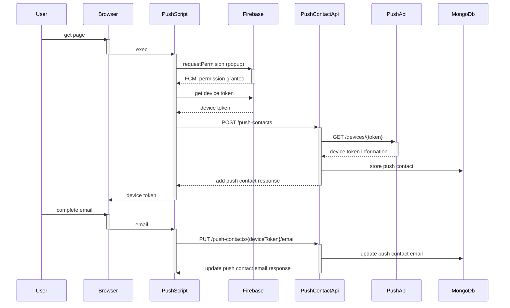
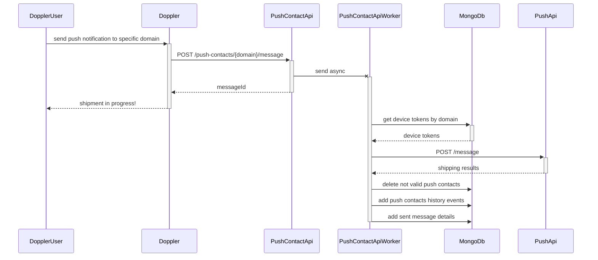
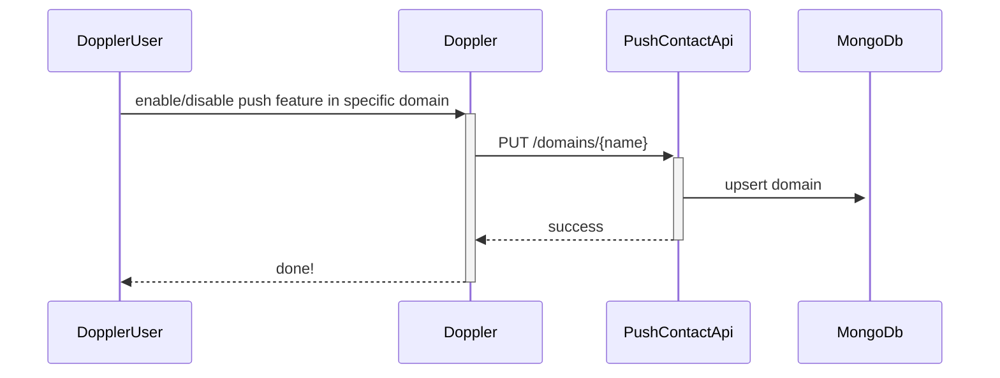
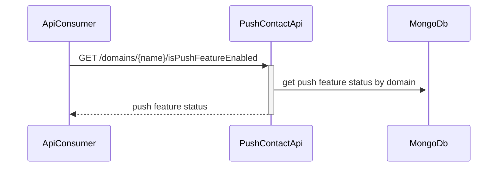
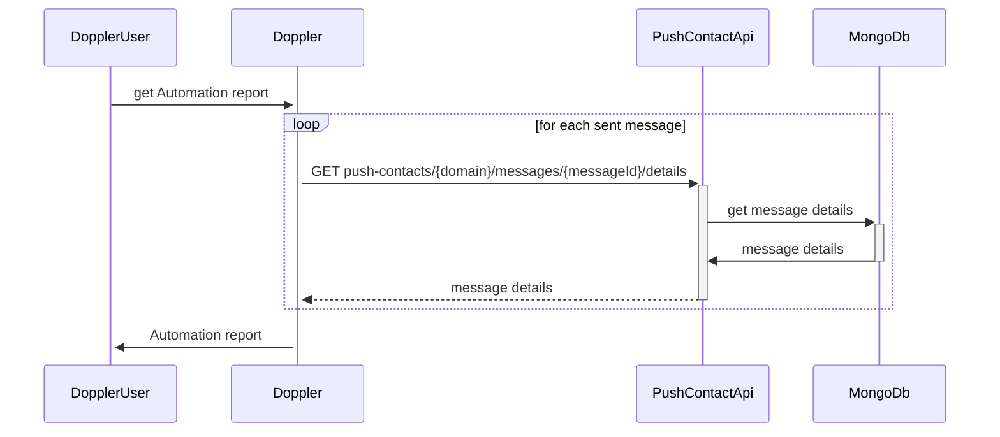

[API contracts](api-contracts.http)

# Add new push contact

# Send push notification from Doppler by domain

# Enable/disable push feature in specific domain from Doppler

# Get push feature status by domain name

# Get Automation report

