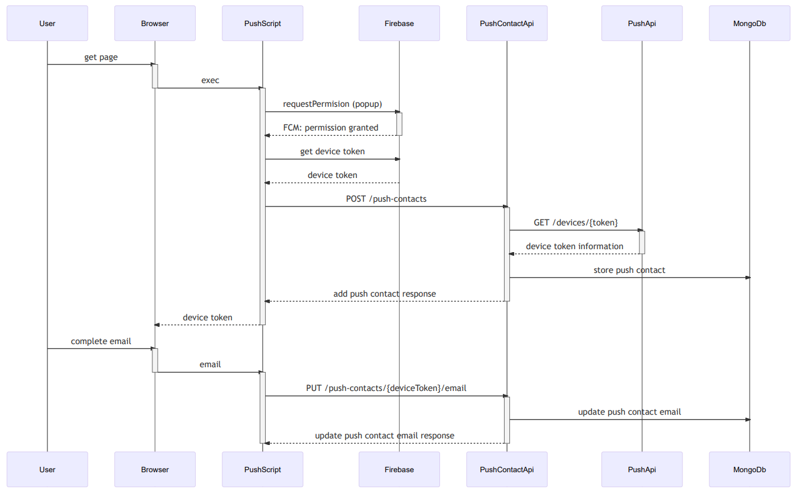
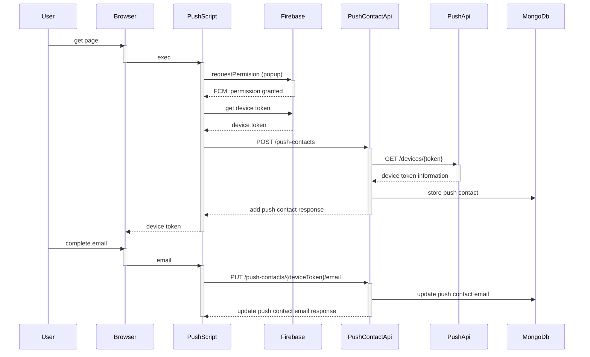
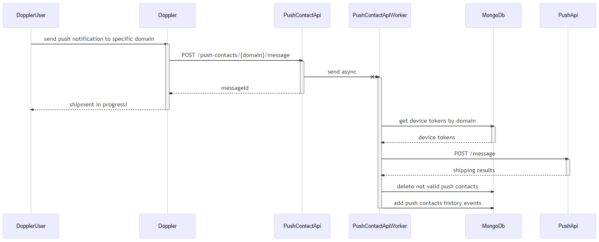
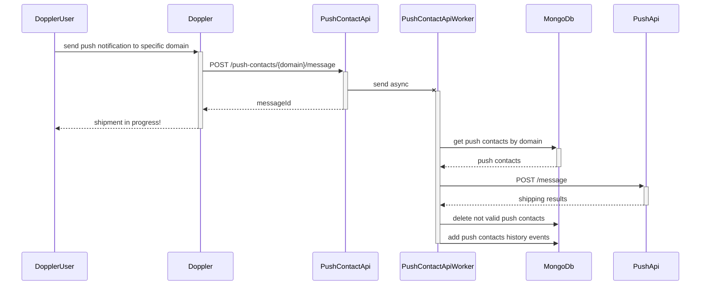

[API contracts](api-contracts.http)

# Add new push contact

### Mermaid sequence diagram

```mermaid
sequenceDiagram
  participant User
  participant Browser
  participant PushScript
  participant Firebase
  participant PushContactApi
  participant PushApi
  participant MongoDb

User->>Browser: get page
activate Browser
Browser->>PushScript: exec
deactivate Browser
activate PushScript
PushScript->>+Firebase: requestPermision (popup)
Firebase-->>-PushScript: FCM: permission granted
PushScript->>Firebase: get device token
Firebase-->>PushScript: device token
PushScript->>+PushContactApi: POST /push-contacts
PushContactApi->>+PushApi: GET /devices/{token}
PushApi-->>-PushContactApi: device token information
PushContactApi->>MongoDb: store push contact
PushContactApi-->>-PushScript: add push contact response
PushScript-->>Browser: device token
deactivate PushScript

User->>Browser: complete email
activate Browser
Browser->>PushScript: email
deactivate Browser
activate PushScript
PushScript->>+PushContactApi: PUT /push-contacts/{deviceToken}/email
PushContactApi->>MongoDb: update push contact email
PushContactApi-->>-PushScript: update push contact email response
deactivate PushScript
```

# Send push notification from Doppler by domain

### Mermaid sequence diagram

```mermaid
sequenceDiagram
  participant DopplerUser
  participant Doppler
  participant PushContactApi
  participant PushContactApiWorker
  participant MongoDb
  participant PushApi
DopplerUser->>+Doppler: send push notification to specific domain
Doppler->>+PushContactApi: POST /push-contacts/{domain}/message
PushContactApi-x+PushContactApiWorker: send async
PushContactApi-->>-Doppler: messageId
Doppler-->>-DopplerUser: shipment in progress!

PushContactApiWorker->>+MongoDb: get push contacts by domain
MongoDb-->>-PushContactApiWorker: push contacts
PushContactApiWorker->>+PushApi: POST /message
PushApi-->>-PushContactApiWorker: shipping results
PushContactApiWorker->>MongoDb: delete not valid push contacts
PushContactApiWorker->>MongoDb: add push contacts history events
deactivate PushContactApiWorker
```
